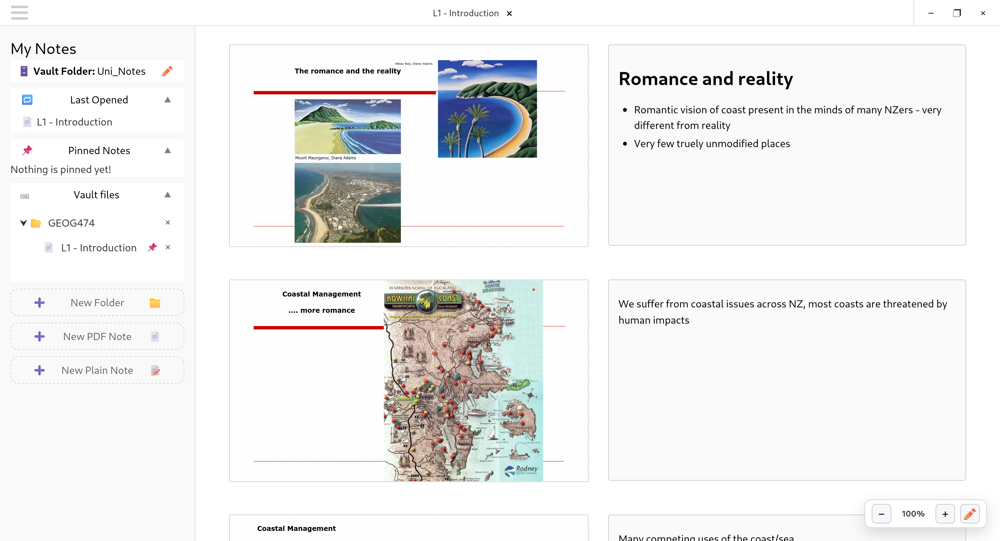

# SimpNote

SimpNote is a simple cross-platform desktop note taking application designed for the way lazy students like me like to take lectures notes. This free and open source project (see `LICENSE.md`) has been built using Svelte 5, SvelteKit, TypeScript, and Tauri 2, with the aim of being lightweight and easy to work with.

SimpNote revolves around two core note types: plain notes, providing an infinite page for note taking and PDF notes - allowing for notes to be taken associated with each page in a PDF. Both note types support markdown syntax, enabling the user to switch between the raw text in the editing mode, and rendered markdown in the viewer mode (live in-editor markdown rendering is planned).

Similar to Obsidian, notes are stored in a local vault folder on disk chosen by the user. This enables the user to leverage their own prefered cloud syncing tool to enable their notes to be available anywhere.



## Motivation
I developed this project after moving to Linux, and failing to find a note taking tool for my university studies that did just what I wanted. Before developing this app I was using OneNote to take notes. However, I never leveraged most of the features that OneNote offers, I simply liked importing the PDF of the lecture slides so I could take brief bullet point style notes beside them. I noticed that most of the other students in my classes were taking notes in a similar way. Therefore I set out to build a simplified lightweight note taking application tailored to this simple workflow.

I also choose to develop this project because I had briefly encountered Svelte previously and wanted to learn how to use it, and to develop my programming skills more broadly. I am not a software engineer and have only taken basic computer science courses, so this application is likely to be buggy and my code may not be particularly idiomatic. Full disclosure - for some trickier sections I did get a hand from Claude!

## What It Does

- Allows for two note types: plain notes and PDF notes.
- Allows for the creation of folders, and nested subfolders to organise notes
- Supports rename, delete, drag/drop reordering, and moving notes and subfolders between folders.
- Important or frequently used notes can be pinned
- Supports markdown syntax
- Notes are saved automatically as you write

## Note Types

- `PDF Note`:
  - Allows notes to taken beside each page in the PDF
  - Stored as a note bundle folder `<note_name>` containing:
    - `notes.json`: The user's notes (notes are keyed per PDF page number)
    - `source.pdf`: The associated PDF file
- `Plain Notes`:
  - A single infinite markdown page
  - Stored as a single `<note_name>.md` file


## Vault Storage

Inside the folder you choose as workspace, files and folders are organised as they displayed in the sidebar. The raw note data is all plainly accessible to the user. Move, rename and delete actions are carried out using the Tauri filesystem API. 
The vault also contains a hidden `.system` folder containing `workspace.json` used to persist file order in the sidebar, the pinned note list, the most recently opened note, and eventually it is planned to persist the current point in a given note the user has scrolled to.

## Basic Usage

1. Open/create a new note from the sidebar
2. New PDF notes can also be created by dragging and dropping a PDF file into the canvas.
3. Folders can be selected in the sidebar (selected folder will be highlighted blue). New notes or subfolders will automatically be nested inside the selected folder.
4. Folders and notes can be draged and droped in the folder list to rearange their order, and move them between folders.
5. Folders and notes can be renamed by clicking their name in the folder list.
6. In the note editor use the control widget at the bottom right to zoom the canvas in and out and toggle between editing mode (raw markdown) and viewing mode (rendered markdown).

## Architecture

The system relies on building an in-memory tree node representation of the vault file system on disk. The file tree is built by walking the vault directory in Rust (`build_tree` in `src-tauri/src/lib.rs`), which returns a serialized tree to the frontend. The Svelte store `lib/vault/backend/store.svelte.ts` then owns the authoritative in-memory tree, tracking display order (via `workspace.json`) separately from the underlying filesystem structure — this lets reordering and nesting update instantly without round-tripping to disk on every drag/drop. All filesystem mutation calls flow in one direction: Components → store → fileSystem.ts → Tauri APIs.

# Known issues
- PDF image rendering - some images embedded in PDFs do not render at all and some is zoom-level dependent

## Planned Features/Updates
These features/improvements are planned to be added/implemented soon:
- Live markdown rendering in edit mode + markdown toolbar
- The ability to reorder notes in the pinned list
- More aesthetically pleasing native looking window controls

## Development guide
Follow the guide below to set up a development environment on Debian or Fedora based systems. Begin by installing the necessary prerequisites.

### 1. System dependencies

#### Debian based

```bash
sudo apt update
sudo apt install libwebkit2gtk-4.1-dev \
  build-essential \
  curl \
  wget \
  file \
  libxdo-dev \
  libssl-dev \
  libayatana-appindicator3-dev \
  librsvg2-dev
```

#### Fedora and derivatives

```bash
sudo dnf check-update
sudo dnf install webkit2gtk4.1-devel \
  openssl-devel \
  curl \
  wget \
  file \
  libappindicator-gtk3-devel \
  librsvg2-devel \
  libxdo-devel
sudo dnf group install "c-development"
```

### 2. Node.js

Use Node 20+ (Node 22 recommended):

```bash
node --version
```

### 3. Rust

```bash
curl --proto '=https' --tlsv1.2 -sSf https://sh.rustup.rs | sh
source $HOME/.cargo/env
rustc --version
cargo --version
```

## Quick Start

```bash
git clone https://github.com/nichmol11/SimpNote
cd SimpNote
npm install
npm run tauri dev
```

This starts the Vite frontend and launches the Tauri desktop app.

## Build

```bash
cd SimpNote
npm run tauri build
```

Bundles are produced under `SimpNote/src-tauri/target/release/bundle/`.

## Useful Scripts

From `SimpNote/`:

- `npm run check` - typecheck + Svelte diagnostics
- `npm run lint` - prettier + eslint
- `npm run test` - unit tests
- `npm run tauri dev` - run desktop app in dev mode
- `npm run tauri build` - produce release build binaries

From `SimpNote/src-tauri/`:
- `cargo check` - check backend rust code for compilation errors

## Troubleshooting

### WebKitGTK errors

- Tauri 2 requires WebKitGTK 4.1 (`libwebkit2gtk-4.1-dev` / `webkit2gtk4.1-devel`).

### Rust build issues

```bash
rustup update
```

### Node dependency issues

```bash
cd SimpNote
rm -rf node_modules package-lock.json
npm install
```

### Blank app window on Linux

```bash
export XDG_DATA_DIRS="/usr/share:$XDG_DATA_DIRS"
```

## Repository Layout

```text
SimpNote/
├── src/
│   ├── lib/
│   │   ├── editor/       # Canvas, PageRow — note editing & PDF viewing UI
│   │   ├── ui/           # Navbar, sidebar, shared components
│   │   └── vault/        
│   │       ├── backend/  # store, fileSystem, pathUtils — vault state & disk I/O
│   │       └── frontend/ # Frontend vault components - TreeView, PinnedList
│   ├── routes/           # SvelteKit routes (+page.svelte, +layout.svelte)
│   └── app.html
├── src-tauri/
│   ├── src/              # Rust backend (main.rs, lib.rs -> tree building function)
│   ├── capabilities/     # Tauri permission config
│   ├── icons/
│   └── tauri.conf.json
├── static/               
└── package.json
```

## References

- https://v2.tauri.app/start/prerequisites/
- https://v2.tauri.app/
- https://svelte.dev/docs
